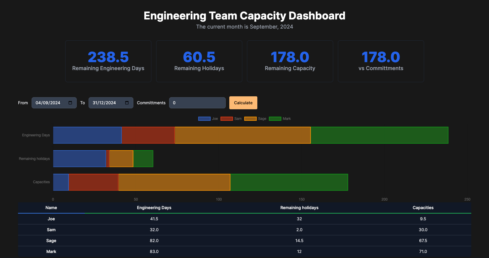

# Engineering Capacity Planner

Welcome to the **Engineering Capacity Planner**! This tool is designed to help engineering managers and heads of engineering effectively plan their team's capacity by taking into account factors like bank holidays and employee absences. It's built using Ruby on Rails with a focus on simplicity and accuracy. Look at the [EM Capacity App](https://emcapacityapp.onrender.com/)



## Features

- **Bank Holidays & Absence Tracking**: Accurately plan capacity by considering scheduled holidays and reported absences.
- **Employee Engineering Factor**: Configure an employee's engineering contribution as a factor between 0 and 1. For example, a hands-on engineering manager might be set to 0.5.
- **Admin Interface**: Manage data easily with a user-friendly administrative dashboard.
- **Customizable Settings**: Adjust parameters to fit your organization's specific needs.

## Getting Started

### Prerequisites

- Ruby 3.0.0 or later
- Rails 6.1 or later
- PostgreSQL (recommended)

### Installation

1. Clone the repository:

   ```bash
   git clone https://github.com/JIAZHEN/em-capacity-app.git
   cd em-capacity-app
   ```

2. Install dependencies:
   ```bash
   bundle install
   ```
3. Setup database

   ```bash
   ./bin/rails db:create
   ./bin/rails db:migrate
   ```

4. Start it

   ```bash
   ./bin/dev
   ```

### Usage

Navigate to http://localhost:3000 to access the application.
Use the http://localhost:3000/admin interface to manage holidays, absences, and other settings.

## License

This project is licensed under the MIT License. See the [LICENSE](MIT-LICENSE) file for details.

## Support & Donations

If you find this tool helpful, consider [buying me a coffee](https://github.com/sponsors/JIAZHEN)! Any donation is appreciated and will keep me fueled for future developments... ☕️
